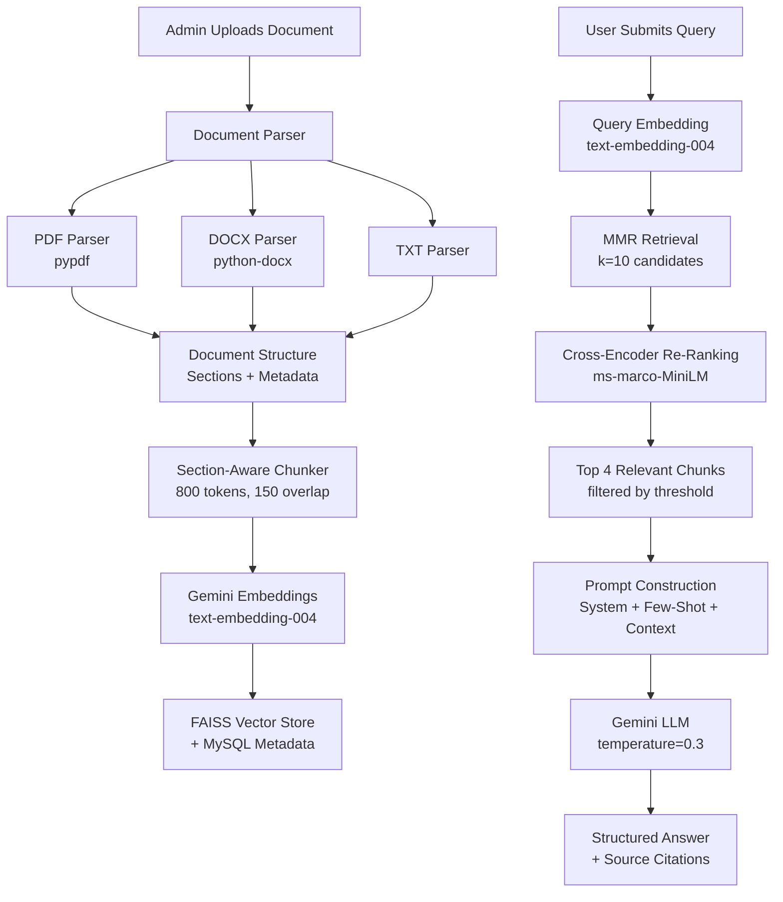

# Rebuild RAG Pipeline — Production-Grade Retrieval-Augmented Generation

## Problem

The current `rag.py` is a skeleton that uses **FakeEmbeddings** (random vectors), does no real document parsing, has no LLM call for answer generation, and returns raw text chunks as "answers". The pipeline needs to be rebuilt end-to-end.

## Current State → Target State

| Stage | Current | Target |
|---|---|---|
| **Document Parsing** | `file.read().decode()` — raw bytes | Structured parsing for PDF, DOCX, TXT with metadata |
| **Structure Extraction** | None | Extract headings, sections, tables, paragraphs |
| **Chunking** | Basic `RecursiveCharacterTextSplitter` | Section-aware chunking with rich metadata |
| **Embeddings** | `FakeEmbeddings(size=768)` — random | Google Gemini `text-embedding-004` |
| **Vector Storage** | FAISS with no metadata tracking | FAISS + document metadata in DB |
| **Retrieval** | `similarity_search(k=3)` | MMR search + cross-encoder re-ranking |
| **Answer Generation** | `f"Based on documents: {context}"` | Gemini LLM with few-shot prompt template |

---

## Open Questions

> [!IMPORTANT]
> **Gemini API Key**: Do you already have a `GOOGLE_API_KEY` set up for the Gemini API? The pipeline will use `gemini-2.0-flash` for generation and `text-embedding-004` for embeddings. If you prefer a different provider (OpenAI, etc.), let me know.

> [!NOTE]
> **Re-ranking**: I'll implement a lightweight **cross-encoder re-ranker** using `sentence-transformers` (`cross-encoder/ms-marco-MiniLM-L-6-v2`). This runs locally and is free. If you'd rather skip the re-ranker to keep things simpler, let me know.

---

## Proposed Changes

### 1. Document Parser Module

#### [NEW] [document_parser.py](file:///c:/Users/Ishaan/Documents/Custom%20Office%20Templates/enterprise-rag/backend/document_parser.py)

A dedicated module for parsing different document types and extracting structure:

- **`parse_pdf(file_bytes)`** — Uses `pypdf` to extract text page-by-page, detect headings (via font-size heuristics), and build a section tree
- **`parse_docx(file_bytes)`** — Uses `python-docx` to extract paragraphs with their heading levels, tables, and lists
- **`parse_txt(file_bytes)`** — Splits by blank lines, detects markdown-style headings (`#`, `##`)
- **`extract_document_structure(file_bytes, filename)`** — Router that dispatches to the correct parser based on file extension
- Returns a `DocumentStructure` dataclass:
  ```python
  @dataclass
  class Section:
      heading: str          # Section title
      level: int            # Heading depth (1=H1, 2=H2, etc.)
      content: str          # Text content of this section
      page_number: int | None
      
  @dataclass  
  class DocumentStructure:
      filename: str
      file_type: str        # pdf, docx, txt
      title: str            # Extracted or inferred document title
      sections: list[Section]
      raw_text: str         # Full text fallback
      total_pages: int | None
  ```

---

### 2. Chunking Engine

#### [NEW] [chunker.py](file:///c:/Users/Ishaan/Documents/Custom%20Office%20Templates/enterprise-rag/backend/chunker.py)

Section-aware chunking that preserves document structure in metadata:

- **`chunk_document(doc_structure: DocumentStructure)`** — Main entry point
  - Chunks within section boundaries (doesn't split across sections)
  - Falls back to `RecursiveCharacterTextSplitter` for sections exceeding `chunk_size`
  - Each chunk carries rich metadata:
    ```python
    {
        "filename": "report.pdf",
        "file_type": "pdf",
        "doc_title": "Q4 Financial Report",
        "section_heading": "Revenue Analysis",
        "section_level": 2,
        "page_number": 5,
        "chunk_index": 3,
        "total_chunks": 12
    }
    ```
- **Config constants**:
  - `CHUNK_SIZE = 800` (tokens, not characters)
  - `CHUNK_OVERLAP = 150`

---

### 3. Embeddings & Vector Store

#### [MODIFY] [rag.py](file:///c:/Users/Ishaan/Documents/Custom%20Office%20Templates/enterprise-rag/backend/rag.py) — Complete rewrite

Replace fake embeddings with real Gemini embeddings and add proper vector store management:

```python
# Core configuration
EMBEDDING_MODEL = "models/text-embedding-004"
LLM_MODEL = "gemini-2.0-flash"
LLM_TEMPERATURE = 0.3          # Low for factual accuracy
RETRIEVAL_K = 10                # Candidates to retrieve
RERANK_TOP_N = 4                # Final docs after re-ranking
SIMILARITY_THRESHOLD = 0.35    # Minimum relevance score
```

**Key functions:**

- **`get_embeddings()`** — Returns `GoogleGenerativeAIEmbeddings` instance
- **`ingest_document(file_bytes, filename)`** — Full pipeline:
  1. Parse document → `DocumentStructure`
  2. Chunk → `list[Document]` with metadata
  3. Embed & store in FAISS
  4. Return ingestion stats (chunk count, sections found, etc.)
- **`retrieve_context(query, k=10)`** — Retrieval with MMR:
  1. Use `max_marginal_relevance_search` to get diverse candidates
  2. Re-rank with cross-encoder
  3. Filter by similarity threshold
  4. Return top-N re-ranked documents
- **`ask_query(query)`** — Full query pipeline:
  1. Call `retrieve_context()` to get relevant chunks
  2. Build structured context with section headings
  3. Construct few-shot prompt with examples
  4. Call Gemini LLM with configured temperature
  5. Return answer + source metadata

---

### 4. Prompt Engineering

Inside `rag.py`, a well-crafted prompt template:

```python
SYSTEM_PROMPT = """You are an expert enterprise knowledge assistant. 
Answer questions ONLY based on the provided context from company documents.

RULES:
1. If the context doesn't contain enough information, say so clearly
2. Cite which document and section your answer comes from  
3. Be precise and professional
4. Structure long answers with bullet points or numbered lists"""

FEW_SHOT_EXAMPLES = """
Example 1:
Context: [From "HR Policy v3.pdf", Section: Leave Policy] Employees are entitled to 24 days of paid leave per year...
Question: How many paid leaves do employees get?
Answer: According to the **HR Policy v3.pdf** (Section: Leave Policy), employees are entitled to **24 days** of paid leave per year.

Example 2:  
Context: [From "Security Guidelines.docx", Section: Password Policy] All passwords must be at least 12 characters...
Question: What is the password requirement?
Answer: Per the **Security Guidelines** (Section: Password Policy), passwords must be at least **12 characters** long.
"""
```

---

### 5. Re-Ranking Module

#### [NEW] [reranker.py](file:///c:/Users/Ishaan/Documents/Custom%20Office%20Templates/enterprise-rag/backend/reranker.py)

Cross-encoder re-ranking for improved retrieval precision:

- Uses `sentence-transformers` with `cross-encoder/ms-marco-MiniLM-L-6-v2` (~22MB model)
- **`rerank(query, documents, top_n=4)`** — Scores each (query, doc) pair and returns top-N
- Lazy-loads the model on first use (no startup cost if not querying)
- Falls back gracefully if model download fails (returns original order)

---

### 6. Database Updates

#### [MODIFY] [database.py](file:///c:/Users/Ishaan/Documents/Custom%20Office%20Templates/enterprise-rag/backend/database.py)

Expand the `documents` table to track ingestion metadata:

```sql
CREATE TABLE IF NOT EXISTS documents (
    id INT AUTO_INCREMENT PRIMARY KEY,
    filename VARCHAR(255),
    file_type VARCHAR(20),
    doc_title VARCHAR(500),
    total_chunks INT DEFAULT 0,
    total_sections INT DEFAULT 0,
    total_pages INT,
    file_size_bytes BIGINT,
    status ENUM('processing', 'ready', 'failed') DEFAULT 'processing',
    error_message TEXT,
    uploaded_at TIMESTAMP DEFAULT CURRENT_TIMESTAMP
)
```

---

### 7. API Endpoint Updates

#### [MODIFY] [main.py](file:///c:/Users/Ishaan/Documents/Custom%20Office%20Templates/enterprise-rag/backend/main.py)

Update the `/upload` and `/ask` endpoints:

- **`POST /upload`** — Accept PDF, DOCX, TXT files
  - Validate file type
  - Call `ingest_document()` with raw bytes
  - Store ingestion stats in DB
  - Return detailed response: `{ chunks: 12, sections: 5, status: "ready" }`
- **`POST /ask`** — Enhanced query endpoint
  - Return answer + sources with section info + confidence indicators
  - Response format:
    ```json
    {
      "answer": "According to...",
      "sources": [
        {"filename": "report.pdf", "section": "Revenue", "page": 5, "relevance": 0.92}
      ],
      "model": "gemini-2.0-flash",
      "temperature": 0.3
    }
    ```

---

### 8. Dependencies

#### [MODIFY] [requirements.txt](file:///c:/Users/Ishaan/Documents/Custom%20Office%20Templates/enterprise-rag/backend/requirements.txt)

Add the following packages:

```
langchain-google-genai      # Gemini embeddings + LLM
langchain-community          # FAISS integration
langchain-text-splitters     # Chunking
sentence-transformers        # Cross-encoder re-ranker
```

---

## Architecture Flow



---

## Verification Plan

### Automated Tests
1. Run the server with `python main.py` and verify startup
2. Upload a sample PDF and verify chunking stats are returned
3. Ask a question about the uploaded document and verify:
   - Answer is generated by the LLM (not raw text)
   - Sources include filename, section, and page info
   - Re-ranking scores are present

### Manual Verification
- Upload documents of each type (PDF, DOCX, TXT)
- Verify the Library view shows ingestion metadata
- Ask specific questions and verify answer quality with citations
